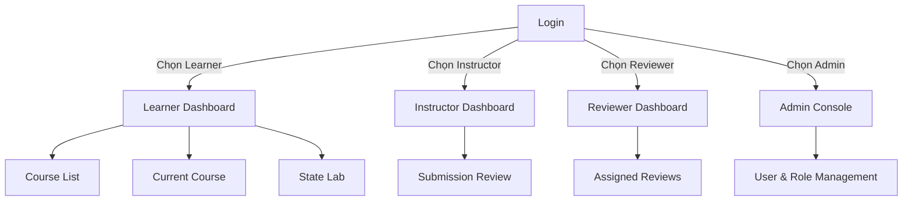
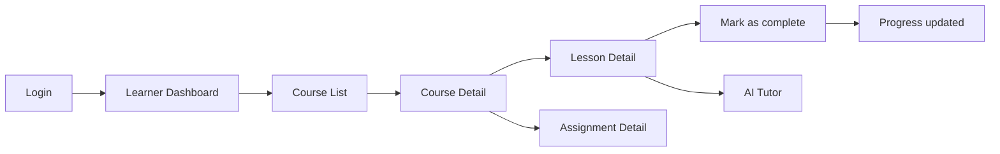
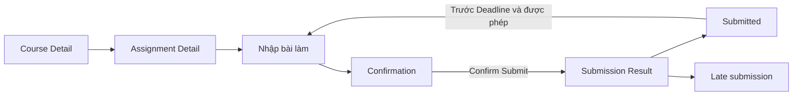
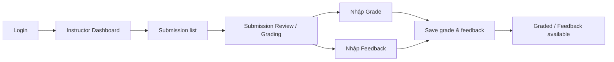
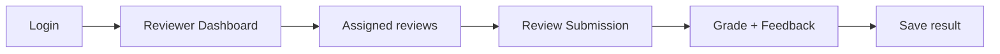
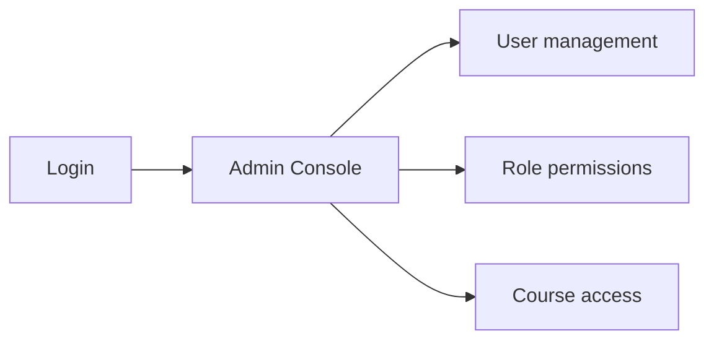
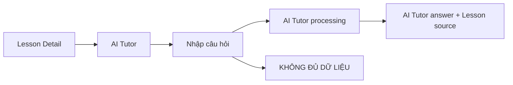

# AI LMS Prototype - User Flow

## 1. Scope

Tài liệu này mô tả navigation và interaction flow của prototype AI LMS tại `docs/03-product/prototype-URL/`. Prototype dùng sample data, không có backend/API/AI thật. Các hành vi chưa được quy định trong source-of-truth phải được xem là `ASSUMPTION` theo [prototype-brief.md](prototype-brief.md). Bản này là User Flow của prototype và cần được đọc đồng bộ với [prototype-brief.md](prototype-brief.md) và [PRD.md](PRD.md), không phải như một tài liệu riêng tạo mới requirement/business rule.

## 2. Entry và role routing

| Screen | Entry action | Exit / next screen | Main state |
|---|---|---|---|
| Login | Mở prototype | Chọn role và Continue | default |
| Learner Dashboard | Continue với Learner | Course List, Course Detail | default |
| Instructor Dashboard | Continue với Instructor | Submission Review | default |
| Reviewer Dashboard | Continue với Reviewer | Assigned Reviews / Submission Review | default |
| Admin Console | Continue với Admin | User & Role Management | default |
| State Lab | Learner chọn State lab | Kích hoạt state demo hoặc quay lại Course List | default |

## 3. FLOW A - Learner học Course / Lesson

### A1. Course discovery

1. Learner đăng nhập bằng sample role `Learner`.
2. Dashboard hiển thị Course đang học, progress và assignment sắp đến hạn.
3. `Browse courses` mở Course List.
4. Course List hiển thị 3 Course sample.
5. Chọn Course đã enroll mở Course Detail với trạng thái `Enrolled`.
6. Chọn Course chưa enroll mở Course Detail với trạng thái `Not enrolled`; Lesson/Assignment bị khóa cho đến khi Enroll.
7. Chọn `Enroll in course` hiển thị success feedback và chuyển Course sang trạng thái enrolled.

**Áp dụng:** `REQ-LMS-03`, `REQ-LMS-04`, `REQ-LMS-05`, `BR-LMS-02`, `BR-LMS-03`.

### A2. Lesson và Progress

1. Từ Course Detail, Learner chọn Lesson.
2. Lesson Detail hiển thị title, duration, content, completion status và Course progress.
3. Lesson chưa hoàn thành hiển thị `Mark as complete`.
4. Sau khi chọn action, Lesson chuyển thành `Lesson completed`; progress được cập nhật và success feedback xuất hiện.
5. Learner quay lại Course Detail để thấy trạng thái Lesson mới.
6. Khi đủ Lesson bắt buộc và Assignment bắt buộc, Course có thể chuyển thành Completed theo rule.

**Áp dụng:** `REQ-LMS-05`, `REQ-LMS-06`, `REQ-LMS-20`, `REQ-LMS-21`, `BR-LMS-12`, `BR-LMS-13`.

## 4. FLOW B - Assignment / Submission

1. Course Detail → `Open assignment` mở Assignment Detail.
2. Assignment Detail hiển thị instructions, Deadline, attempts và trạng thái `Incomplete`.
3. Learner nhập text response trong vùng `Your submission`.
4. Với bài hợp lệ, flow cần hiển thị confirmation trước critical action Submit. Trong prototype, State Lab dùng để kiểm chứng confirmation; form Submit trực tiếp là sample interaction hiện tại.
5. Submit đúng hạn mở Submission Result với trạng thái `Submitted`, timestamp và thông báo đang chờ Instructor review.
6. `Demo late submission` mở Submission Result với trạng thái `Late submission` và cảnh báo đã nộp sau Deadline.
7. Với Assignment cho phép Submit lại trước Deadline, Submission Result cung cấp đường quay lại Assignment.
8. Nếu text response rỗng, hiển thị error feedback yêu cầu thêm nội dung.

**Áp dụng:** `REQ-LMS-07`, `REQ-LMS-08`, `REQ-LMS-09`, `REQ-LMS-10`, `BR-LMS-04`, `BR-LMS-05`.

## 5. FLOW C - Instructor grading và Feedback

1. Đăng nhập bằng sample role `Instructor` mở Instructor Dashboard.
2. Dashboard hiển thị Course, submission rate và danh sách Learner.
3. Submission list phân biệt:
   - `Needs review`: Learner đã nộp nhưng chưa Grade.
   - `Graded`: đã có Grade/Feedback.
   - `Not submitted`: Learner chưa nộp.
4. Chọn `Review` mở Submission Review / Grading.
5. Instructor xem bài làm, nhập Grade và Feedback.
6. Chọn `Save grade & feedback` cập nhật kết quả và success feedback.
7. Grade phải gắn với Submission cụ thể; Learner chỉ được xem Grade/Feedback của chính mình theo business rule.
8. Reviewer và Admin không thay thế Instructor trong flow này; việc phân công Reviewer được thực hiện bởi Instructor/Admin theo BR-LMS-09.

**Áp dụng:** `REQ-LMS-14`, `REQ-LMS-15`, `REQ-LMS-19`, `BR-LMS-06`, `BR-LMS-07`, `BR-LMS-09`, `BR-LMS-10`, `BR-LMS-11`, `BR-LMS-17`.

## 6A. FLOW D1 - Reviewer review Submission được phân công

1. Đăng nhập bằng sample role `Reviewer` mở Reviewer Dashboard.
2. Dashboard hiển thị các Submission được phân công cho Reviewer.
3. Reviewer chọn một Submission trong hàng đợi để xem bài làm và đánh giá.
4. Reviewer nhập Grade và Feedback theo Submission được giao.
5. Hệ thống chỉ cho Reviewer xem các Submission được phân công, không phải toàn bộ hệ thống.

**Áp dụng:** `REQ-LMS-16`, `REQ-LMS-17`, `REQ-LMS-18`, `BR-LMS-08`, `BR-LMS-09`.

## 6B. FLOW D2 - Admin quản trị hệ thống

1. Đăng nhập bằng sample role `Admin` mở Admin Console.
2. Admin xem danh sách người dùng, role và quyền truy cập.
3. Admin kiểm tra/điều chỉnh phân quyền hoặc truy cập Course theo quy định hệ thống.
4. View này phục vụ quản trị hệ thống, không phải flow học tập của Learner.

**Áp dụng:** `REQ-LMS-26`, `REQ-LMS-27`, `BR-LMS-01`, `BR-LMS-09`, `BR-LMS-17`.

## 6. FLOW D - AI Tutor trong Lesson

1. Learner mở AI Tutor từ Lesson Detail.
2. Tutor hiển thị context Lesson hiện tại, không tách khỏi Course/Lesson.
3. Learner hỏi về empathy, insight, journey mapping hoặc prototyping.
4. Prototype hiển thị processing delay, sau đó trả lời sample response và `Source · Lesson ...`.
5. Câu hỏi ngoài context có thể kích hoạt `KHÔNG ĐỦ DỮ LIỆU`; không hiển thị thông tin suy đoán.
6. Với câu hỏi liên quan Assignment, Tutor chỉ giải thích/gợi ý hoặc dẫn về Lesson, không cung cấp đáp án hoàn chỉnh.

**Áp dụng:** `REQ-LMS-22`, `REQ-LMS-23`, `REQ-LMS-24`, `REQ-LMS-25`, `NFR-LMS-05`, `BR-LMS-14`, `BR-LMS-15`, `BR-LMS-16`.

## 7. State flow

| State | Cách kích hoạt / màn hình | Expected feedback |
|---|---|---|
| `default` | Mở mọi màn hình hoặc Reset State Lab | Nội dung sẵn sàng, CTA rõ ràng |
| `loading` | State Lab → Test Loading; AI Tutor khi gửi câu hỏi | Hiển thị đang tải/xử lý |
| `empty` | State Lab → Test Empty | Nêu không có kết quả Course |
| `error` | State Lab → Test Error; nhập grade/feedback thiếu; Submit rỗng | Nêu lỗi và có Retry hoặc chỉnh dữ liệu |
| `permission denied` | State Lab → View guard với Course chưa enroll | Không cho mở Lesson; hướng về Course/enrollment |
| `incomplete` | Course Detail / Assignment Detail | Nêu Lesson hoặc Assignment cần thao tác |
| `submitted` | Assignment → Submit assignment | Submission Result, timestamp, awaiting review |
| `late submission` | Assignment → Demo late submission | Hiển thị rõ Late và timestamp |
| `graded` | Instructor review với Submission đã graded | Hiển thị Grade mẫu |
| `feedback available` | Instructor review với Submission có Feedback | Hiển thị Feedback gắn với Submission |
| `AI Tutor processing` | Lesson → AI Tutor → gửi câu hỏi | Hiển thị trạng thái xử lý trước response |
| `AI Tutor answer` | Câu hỏi trong Lesson context | Answer + Lesson source |
| `AI Tutor không đủ dữ liệu` | AI Tutor → Try insufficient context | Hiển thị chính xác `KHÔNG ĐỦ DỮ LIỆU` |
| `confirmation` | State Lab → Test Confirmation | Có Cancel và Confirm trước action |
| `success` | Confirm, Save Grade/Feedback, Complete Lesson hoặc Enroll | Thông báo thao tác thành công |

## 8. Screen inventory

| ID | Screen | Primary user | Main purpose |
|---|---|---|---|
| S01 | Login | Learner / Instructor | Chọn sample role và vào workspace |
| S02 | Learner Dashboard | Learner | Course đang học, progress, assignment |
| S03 | Course List | Learner | Xem 3 Course sample |
| S04 | Course Detail | Learner | Enrollment, Lesson list, Assignment, Progress |
| S05 | Lesson Detail | Learner | Đọc content, complete, mở AI Tutor |
| S06 | Assignment Detail | Learner | Instructions, Deadline, nhập và Submit bài |
| S07 | Submission / Submit Assignment | Learner | Form text response và submit action |
| S08 | Submission Result | Learner | Submitted hoặc Late, timestamp và next step |
| S09 | Instructor Dashboard | Instructor | Course progress và trạng thái từng Learner |
| S10 | Submission Review / Grading | Instructor | Xem bài, Grade và Feedback |
| S11 | Feedback | Learner / Instructor | Feedback nằm trong Submission result/review |
| S12 | AI Tutor | Learner | Hỏi đáp trong Lesson context |
| S13 | Reviewer Dashboard | Reviewer | Xem Submission được phân công |
| S14 | Admin Console | Admin | Quản lý User, Role và quyền truy cập |
| S15 | State Lab | QA / Reviewer | Kích hoạt required states để kiểm tra |

## 9. Navigation checklist

- [ ] Login → Learner Dashboard.
- [ ] Login → Instructor Dashboard.
- [ ] Learner Dashboard → Course List.
- [ ] Course List → Course Detail.
- [ ] Course chưa enroll → Enroll → trạng thái Enrolled.
- [ ] Course Detail → Lesson Detail → Mark complete → Progress updated.
- [ ] Course Detail → Assignment Detail → Submit đúng hạn → Submitted.
- [ ] Assignment Detail → Demo late submission → Late submission.
- [ ] Instructor Dashboard → Submission Review → Grade + Feedback → Save success.
- [ ] Lesson Detail → AI Tutor → processing → answer + source.
- [ ] AI Tutor → insufficient context → `KHÔNG ĐỦ DỮ LIỆU`.
- [ ] State Lab kiểm tra loading, empty, error, permission, confirmation và success.

## 10. Source-of-truth

Requirement và Business Rule được tham chiếu trong [prototype-brief.md](prototype-brief.md) và [PRD.md](PRD.md). User Flow này chỉ mô tả cách prototype kiểm chứng các item đó; không tạo thêm Requirement hoặc Business Rule. Tên tài liệu được thống nhất là User Flow để tránh nhầm lẫn với Prototype Brief và Screen Flow khác trong docs/03-product.
