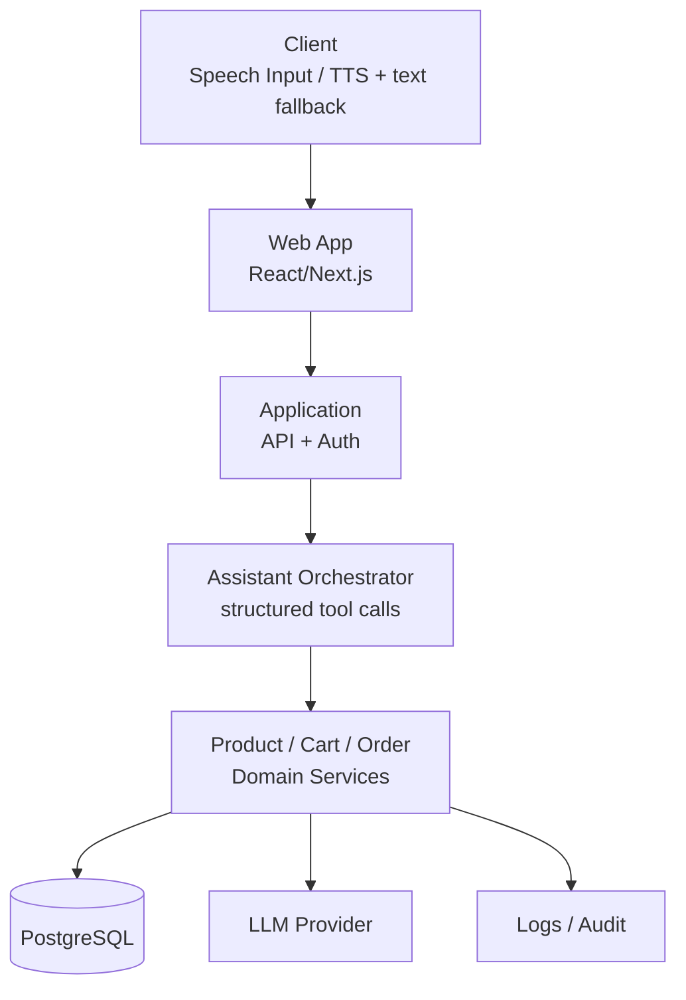

# Architecture

## Workflow



## 1. Context / Container

Orbit LMS là hệ thống học tập AI hỗ trợ người học, giảng viên, reviewer, và quản trị viên. Ứng dụng được triển khai theo mô hình web app với UI layer, application service layer, domain services, và external LLM/voice services.

### Context

- Người dùng truy cập hệ thống qua trình duyệt web.
- Người dùng có vai trò Learner, Instructor, Reviewer, Admin.
- Hệ thống có màn hình học tập, nộp bài, chấm bài, review, dashboard, và AI Tutor.

### Container

1. Client UI
   - HTML/CSS/JS static prototype UI, hoặc web SPA tương lai.
   - Giao diện đọc từ design docs và display nội dung UI.

2. Application/API Layer
   - Domain services cho Course, Lesson, Assignment, Submission, Review, AI Tutor.
   - Product/Cart/Order service là source-of-truth cho nghiệp vụ đặt hàng / workflow.

3. Data Layer
   - Database lưu course, lesson, assignment, submission, grade, feedback, user account, role, audit events.

4. External services
   - LLM service for AI Tutor answer generation.
   - Voice provider for speech input/output.
   - Notification/logging/audit services.

## 2. Modules

### Module: User & Role
- User profile
- Role access
- Permission validation

### Module: Course & Learning
- Course list
- Course detail
- Lesson detail
- Lesson completion progress

### Module: Assignment & Submission
- Assignment brief
- Submission draft
- Submission result
- Grade and feedback

### Module: Review & Assessment
- Instructor dashboard
- Teacher grade and feedback
- Reviewer assignment queue

### Module: AI Tutor
- Input user question
- Context retrieval
- Structured answer generation
- Voice control and answer display

### Module: Audit / Observation
- Tool call metadata
- Result, status, latency
- Order creation events

## 3. Integration

### Client -> Application/API
- UI gửi request đến API layer theo schema chuẩn.
- API layer validate role, request payload, business rules, and authorization.

### Application/API -> Data
- Business services query/write data using repository/service layer.
- Product/Cart/Order service acts as source-of-truth for business objects.

### Application/API -> External
- LLM service receives structured instructions only.
- Voice service handles speech-to-text or text-to-speech if needed.

### LLM Rule
- LLM không truy cập DB trực tiếp.
- LLM chỉ đề xuất structured tool call.
- Application validate tool name, role, arguments, and business rules trước khi gọi domain service.

## 4. Data model and constraints

### Core entities

| Entity | Main fields |
| --- | --- |
| User | id, role, name, email |
| Course | id, title, category, description, status |
| Lesson | id, course_id, title, content, duration, status |
| Assignment | id, course_id, lesson_id, title, deadline, max_attempts |
| Submission | id, assignment_id, learner_id, answer, submitted_at, status |
| GradeFeedback | submission_id, grade, feedback, reviewer_id |
| OrderDraft | id, user_id, status, total, order_event |
| AuditLog | id, actor_id, action, tool_name, tool_args, result, latency_ms, created_at |

### Business constraints

- Submission must contain non-empty answer before submit.
- Grade and feedback must both be present before grade can be saved.
- Permission must be checked before learner or reviewer accesses protected content.
- Late submission is flagged only when submission time is after deadline.
- Product/Cart/Order service owns cart and order creation state.

## 5. API contract

### Example endpoints

| Method | Path | Purpose |
| --- | --- | --- |
| GET | `/api/courses` | List courses |
| GET | `/api/courses/:id` | Get course detail |
| GET | `/api/lessons/:id` | Get lesson detail |
| POST | `/api/submissions` | Submit assignment |
| POST | `/api/submissions/:id/grade` | Save grade and feedback |
| POST | `/api/tutor/ask` | Ask AI Tutor |
| POST | `/api/orders` | Create order draft/order |

### API contract notes

- Request and response payload must be explicitly typed.
- Validation failure returns field-level errors.
- Business rule failure returns proper domain message.

## 6. Story Spec

### Story Spec

Story ID: US-LMS-11
Requirement IDs: US-LMS-11, NFR-LMS-06
Design link: docs/04-design/screen-inventory.md
Goal: Learner submits assignment and receives confirmation.
Preconditions: Learner is enrolled and assignment content is available.
Happy path: Input answer, press Submit, modal confirm, submission persists, result screen displays.
Alternate/error paths:
- Empty answer -> show error and keep draft.
- Late submission -> mark late.
- Failed save -> show retry message and keep draft.
Data read/write:
- Read course, lesson, assignment, learner context.
- Write submission, audit metadata.
API contract:
- POST `/api/submissions`
Authorization:
- Learner must own course access.
Validation/business rules:
- Assignment answer must not be empty.
- Deadline respected before save.
Observability/logging:
- Audit event with action, user, status, latency.
Test plan:
- Unit test validation.
- Integration test API contract.
- UI test happy/error/late submission flows.
Definition of Done:
- Submission success, error, and confirm flows tested.

## 7. ADR

### ADR-01: Use server-side service layer as source of truth

Status: Accepted

Context: Need a consistent source for business data and workflow. The UI prototype exposes relevant actions, but backend and product services must own domain state.

Decision: Product/Cart/Order service is source-of-truth for business process, cart/order, and order-draft events. LLM tools cannot call DB directly.

Trade-off: More service-layer validation and audit wiring means more implementation work, but it avoids hidden product logic in the UI and reduces risk from unauthorized or unvalidated LLM actions.

### ADR-02: LLM tool-call structure

Status: Accepted

Context: AI Tutor and AI workflow need structured tool calls without raw DB access.

Decision: LLM produces structured tool call proposals. The application validates tool name, role, arguments, and business rules before calling the domain service.

Trade-off: Adds validation and negotiation complexity, but improves safety and consistency.

## 8. Security and observability

- Never send or store secret tokens, raw audio, or credentials in logs.
- Audit logs store tool call metadata, result, latency, and order creation event.
- Audit logs do not store raw secret or raw audio.
- Every service call validates authorization and input.

## 9. CI and local setup

### Minimal CI

- Lint
- Unit test
- Build check
- Basic integration smoke test

### Environment example

```env
FIGMA_PERSONAL_ACCESS_TOKEN=your_token_here
AI_PROVIDER_URL=https://example-ai
VOICE_PROVIDER_URL=https://example-voice
DB_URL=postgres://localhost:5432/orbit_lms
```

## 10. Assistant Command Schema

The assistant must interact with the product/cart/order domain with a typed command grammar. The command is produced by the assistant orchestrator as a structured proposal and then validated by the application before a domain service is executed.

```ts
type AssistantCommand =
  | { type: "SEARCH_PRODUCTS"; query?: string; category?: string; maxPrice?: number }
  | { type: "GET_PRODUCT"; productId: string }
  | { type: "ADD_TO_CART"; productId: string; quantity: number }
  | { type: "UPDATE_CART_ITEM"; cartItemId: string; quantity: number }
  | { type: "GET_CART" }
  | { type: "CREATE_ORDER_DRAFT" }
  | { type: "CONFIRM_ORDER"; draftId: string; confirmationToken: string }
  | { type: "GET_ORDER_STATUS"; orderId?: string }
  | { type: "CLARIFY"; question: string; candidates?: string[] };
```

### Validation rules

- `quantity` must be an integer in the inclusive range `1..99`, and the domain service then checks stock availability.
- `CONFIRM_ORDER` requires an unexpired order draft and a matching `confirmationToken`.
- Tool access is role-scoped through a tool whitelist. `CUSTOMER` cannot access admin tools.
- Unknown or low-confidence intents must return `CLARIFY`; the system must never guess a critical action.

## 11. Implementation note

This architecture avoids over-engineering. It keeps the system lean by separating UI, application/service validation, domain rules, and audit logging. The design supports a static front-end prototype today while preparing for a real API and structured service architecture.
